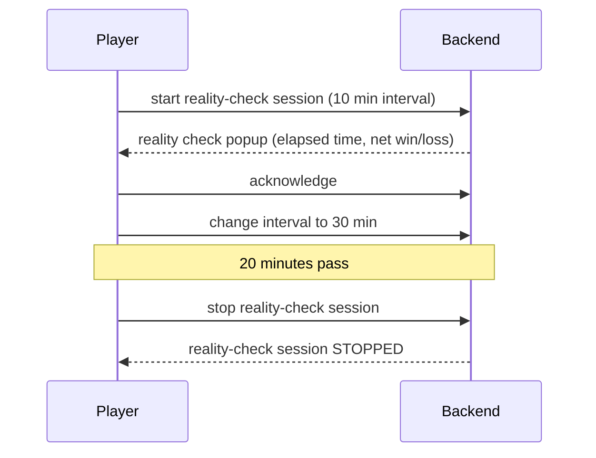

# Reality Check service

A small backend service for our **Reality Check** responsible-gaming feature.

While a player is in a gaming session, the service periodically triggers frontend to show them a *reality check*:
a popup reminder of how long they have been playing and their net win/loss so far, so they can
actively check in on their own wellbeing and acknowledge it. The service keeps, per player, the
state of their current reality-check session (interval, elapsed time, net amount, and when the
next check is due).

This repository is a self-contained starting point. It builds and runs on its own with no
access to any internal systems.

## Example flow



## Tech stack

- Java 25
- Spring Boot 4.1
- Spring Web + JDBI v3
- H2 in-memory database, started in **MySQL compatibility mode**
- Liquibase (schema + seed data applied automatically on startup)
- springdoc-openapi / Swagger UI
- Maven

## Running it

### With Docker (recommended)

```bash
docker compose up --build
```

### Locally with Maven

Requires JDK 25.

```bash
mvn clean package
java -jar target/reality-check-legacy.jar
```

The service starts on port `8080` under the context path `/reality-check`.
On startup Liquibase creates the `player` and `reality_check_session` tables and seeds a few rows.

## API documentation

- Swagger UI: http://localhost:8080/reality-check/swagger-ui.html
- OpenAPI JSON: http://localhost:8080/reality-check/v3/api-docs
- H2 console: http://localhost:8080/reality-check/h2-console
  (JDBC URL `jdbc:h2:mem:realitycheck`, user `sa`, empty password)

## Seeded data

| Player ID | Franchise | Reality-check session |
|-----------|-----------|-----------------------|
| 1001      | 10        | ACTIVE, 60 min interval |
| 1002      | 10        | ACTIVE, 30 min interval |
| 1003      | 20        | none yet |

## Example requests

```bash
BASE=http://localhost:8080/reality-check

# Current reality-check status for a player
curl "$BASE/realitycheck/getStatus/1001"

# Get the current reality-check session, or start one if none exists
curl "$BASE/realitycheck/getOrStartSession/1003/45"

# Stop a player's reality-check session
curl -X POST "$BASE/realitycheck/stopSession/1002"
```

---

## Assignment

This service is functional but has grown organically and now needs some attention. You have been
handed the following requests from around the company. Treat them the way you would treat real tickets in the backlog. 
Be ready to explain your decisions.

1. **Engineering — pay down the debt.**
   The team needs this legacy service refactored to remove technical debt and make it future-proof.
   Improve the structure, naming and correctness where you see fit.

2. **QA — make the API usable and documented.**
   QA frequently has to ask developers how to call these endpoints because the current API
   documentation is not informative. Make the API and its generated documentation clear and usable.

3. **Tech Ops — scale out.**
   Tech Ops plans to increase the replica count in Kubernetes and has asked everyone to make sure
   their service behaves correctly when running as more than one instance.

4. **Compliance — persist acknowledgement timestamps.**
   Compliance requires that every time a player acknowledges a reality check, the exact date and time
   of that acknowledgement is persisted in the database for reporting purposes.

5. **Frontend (React) — return a formatted timestamp.**
   The frontend has asked for date and time data to be returned formatted in the player's own time zone
   (the `timezone` field stored on the player record).
   The proposed format is: day as a number, month as the full word, 2-digit year, then hours and
   minutes in 24 h format, with no time-zone suffix.
   Example: `"6 July 26 14:35"`

You are free to change anything in the codebase, add dependencies, extend the infrastructure in
`docker-compose.yml`, and add new Liquibase change sets as needed. AI usage is encouraged.
